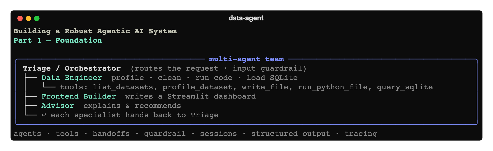

# Building a Robust Agentic AI System, Part 1: The Foundation



*A hands-on series on building a real, multi-agent data assistant with the OpenAI Agents
SDK. We start with a working foundation, then add retrieval, external tools, a polished CLI,
guardrails, observability, and evals — one article at a time.*

---

By the end of this article you'll have a running multi-agent system you can talk to in plain
English: *"profile and clean this messy CSV, load it into a database, and build me a
dashboard."* It will profile the data, **write and run real Python** to clean it, load the
result into SQLite, and generate a Streamlit dashboard — coordinated by a team of focused
agents that hand work to each other.

This first part is the **foundation**: the agent loop, tools, handoffs, a safety guardrail,
persistent memory, structured outputs, and tracing. Later parts add a knowledge base (RAG),
external tool servers (MCP), a real CLI, deeper guardrails, observability, and an evaluation
suite. Each article ships a complete, runnable code snapshot — the code for *this* one lives
in [`code/`](./code).

> **Stack:** Python 3.10+ · [OpenAI Agents SDK](https://openai.github.io/openai-agents-python/)
> (`openai-agents`) · pandas · SQLite · Streamlit.

---

## 1. What is an "agent," really?

A plain LLM call is a function: text in, text out. It can't *do* anything in the world.

An **agent** wraps that LLM in a loop and gives it **tools** — functions it's allowed to
call. On each turn the model can either produce a final answer *or* ask to call a tool. When
it calls one, your code runs the function, feeds the result back, and the model decides what
to do next. That loop — **think → act → observe → repeat** — is what makes a system
*agentic*: it can take multiple steps, react to what it observes, and pursue a goal.

```
            ┌─────────────────────────────────────────────┐
            │                  AGENT LOOP                   │
  user ───▶ │  model thinks ─▶ wants a tool? ─▶ run tool ─┐ │
            │       ▲                                     │ │
            │       └──────── feed result back ◀──────────┘ │
            │                  │ no more tools               │
            └──────────────────┼──────────────────────────--┘
                               ▼
                          final answer ───▶ user
```

The **OpenAI Agents SDK** is a small, production-minded framework that implements this loop
for you and adds the pieces you need to make it robust: handoffs between specialized agents,
guardrails, persistent memory (sessions), structured outputs, and built-in tracing. This
article uses all of them.

The philosophy that runs through the whole series: **keep the model in charge of decisions,
keep correctness in ordinary code.** The model decides *when* to clean data or *what* SQL to
run; the tools guarantee *how* that work is actually performed.

---

## 2. The building blocks in this article

| Concept | What it is | Where to see it |
|---------|-----------|-----------------|
| **Agent** | An LLM + instructions + a set of tools/handoffs | `team.py` |
| **Tools** | Python functions the model can call (`@function_tool`) | `tools/` |
| **Handoffs** | One agent transferring the conversation to a specialist | `team.py` |
| **Guardrail** | A fast check that can stop a run (e.g. off-topic) | `guardrails.py` |
| **Sessions** | Persistent conversation memory across turns/restarts | `app.py` |
| **Structured output** | Forcing the model to return typed, parseable data | `schemas.py` |
| **Tracing** | Automatic, inspectable record of every step | built-in |

(Retrieval, MCP, and a real CLI come in the next articles — we're laying the slab first.)

---

## 3. The architecture: a team, not a monolith

Rather than one giant "do everything" agent, we use a small **team** of focused agents
coordinated by a **triage** (orchestrator) agent. Smaller, single-purpose instruction sets
are more reliable than one mega-prompt, and each specialist only gets the tools it needs.

```
                         ┌────────────────────────┐
       user  ───────────▶│  Triage / Orchestrator  │ ◀── input guardrail
                         │  (routes the request)   │     (is this on-topic?)
                         └───────────┬─────────────┘
                 handoff   ┌─────────┼──────────────┐
                           ▼         ▼              ▼
                 ┌──────────────┐ ┌──────────┐ ┌──────────┐
                 │ Data Engineer│ │ Frontend │ │ Advisor  │
                 │ profile/clean│ │ Builder  │ │ explains │
                 │ run code,    │ │ writes a │ │ & guides │
                 │ sqlite       │ │ dashboard│ │          │
                 └──────┬───────┘ └────┬─────┘ └────┬─────┘
                        └──────────────┴────────────┘
                           each can hand BACK to Triage
```

- **Triage** reads your request and hands off to exactly one specialist. It carries the
  input guardrail, so the cheap relevance check happens once, at the front door.
- **Data Engineer** does the real work: profiles the raw CSV, *writes and runs* a cleaning
  script, loads the result into SQLite, and validates with SQL.
- **Frontend Builder** writes a self-contained Streamlit dashboard on top of the database.
- **Advisor** explains concepts and recommends approaches, then hands back when you're ready
  to act.

Specialists **hand back to triage** when done, so a request like *"clean the data and then
build a dashboard"* flows naturally across multiple agents in one conversation.

---

## 4. Run it first (so the code has context)

```bash
cd code
python3 -m venv .venv && source .venv/bin/activate
pip install -e .
cp .env.example .env          # add your OPENAI_API_KEY
python -m data_agent.app
```

A productive first session:

```
user ▸ What data do I have to work with?
user ▸ Profile data/raw/sales_2024.csv and tell me what's wrong with it.
user ▸ Clean it, then load it into SQLite as a table called sales.
user ▸ Build me a dashboard for the cleaned sales data.
```

Then, in a second terminal: `streamlit run workspace/dashboard.py`.

The sample file `data/raw/sales_2024.csv` is intentionally broken so the cleaning step has
real work to do: five different date formats, `$` symbols inside the price column,
inconsistent region casing (`North`/`north`/`NORTH`), a fully duplicated row, blank cells,
and a nonsensical negative quantity.

> If your account doesn't have `gpt-5` yet, set `OPENAI_MODEL=gpt-4.1` in `.env`.

---

## 5. Code walkthrough

The whole project is small. We'll go in the order that builds understanding.

### 5.1 Boundaries first — `config.py`

Before giving a model the ability to write files and run code, decide *where* it may act.
`config.py` defines exactly two areas: a **read-only** `data/raw` and a **writable**
`workspace/`. Everything the agents produce lands in the workspace.

```python
PROJECT_ROOT = Path(__file__).resolve().parents[2]
RAW_DATA_DIR = PROJECT_ROOT / "data" / "raw"      # read-only inputs
WORKSPACE_DIR = PROJECT_ROOT / "workspace"        # the only place we write
MEMORY_DB = WORKSPACE_DIR / ".memory.db"          # conversation memory
```

Confining all writes to one sandbox folder is the foundation that makes file-writing and
code-execution tools safe to expose. Models and paths come from environment variables (via
`.env`), so the same code runs unchanged in dev and prod.

### 5.2 The run context — `context.py`

Tools shouldn't reach for globals. The SDK lets you pass a typed **context** object into a
run; every tool then receives it. Ours records where the agent may read/write and logs the
artifacts it creates:

```python
@dataclass
class PipelineContext:
    raw_data_dir: Path = config.RAW_DATA_DIR
    workspace_dir: Path = config.WORKSPACE_DIR
    artifacts: list[str] = field(default_factory=list)
```

This is dependency injection for tools — and a clean seam for tests (swap the dirs for temp
folders). Importantly, the context is **never serialized into the prompt**, so it's also a
safe place for things the model shouldn't see directly.

### 5.3 Structured output — `schemas.py`

Free-form text is hard to build on. With Pydantic models you force the model (or a tool) to
return typed, validated data. We use it for the data profile and the guardrail's verdict:

```python
class DataProfile(BaseModel):
    path: str
    row_count: int
    duplicate_rows: int
    columns: list[ColumnProfile]
    issues: list[str]            # heuristic data-quality warnings
```

Structured outputs are one of the biggest reliability wins in agentic systems: you trade a
little prompt rigidity for outputs you can branch on in code without parsing English.

### 5.4 Giving the agents hands — `tools/`

A **tool** is just a Python function decorated with `@function_tool`. The SDK reads its type
hints and docstring to build the JSON schema the model sees — **so the docstring is the
tool's API documentation as far as the model is concerned.** Write it carefully.

We split tools into two kinds on purpose:

**Deterministic tools** (`tools/data.py`) — `profile_dataset`, `load_csv_to_sqlite`,
`query_sqlite`. Plain pandas/SQLite, no LLM inside. Anything that must be correct and
repeatable is ordinary code the model merely *orchestrates*. Note `query_sqlite` rejects
anything that isn't a `SELECT` — least privilege, even for the model:

```python
@function_tool
def profile_dataset(ctx: RunContextWrapper[PipelineContext], path: str) -> DataProfile:
    """Profile a CSV and return a structured data-quality report...
    Always profile a dataset before cleaning it.
    """
    ...
```

**The agent's hands** (`tools/filesystem.py`) — `list_datasets`, `read_file_preview`,
`write_file`, and `run_python_file`. The last one *executes code the model wrote*. That's
what makes this a real builder rather than a chatbot — and it's the most dangerous
capability, which is why every path goes through `safe_resolve`.

#### The sandbox — `tools/_paths.py`

```python
def safe_resolve(relative_path: str, *allowed_roots: Path) -> Path:
    candidate = (allowed_roots[0] / relative_path).resolve()
    for root in allowed_roots:
        if candidate == root.resolve() or root.resolve() in candidate.parents:
            return candidate
    raise PathNotAllowed(...)
```

It resolves a (possibly model-supplied) path and **raises if the result escapes the allowed
roots**, rejecting absolute paths and `..` traversal. This one helper is the difference
between "a tool that writes to a sandbox" and "a tool that can overwrite
`~/.ssh/authorized_keys`." `run_python_file` additionally runs in a subprocess with a
timeout and the workspace as its working directory.

> **Honest scope:** for a *local* teaching example this is reasonable. It is **not** a
> security boundary for untrusted input — a determined script can still reach the network.
> Part 5 (Guardrails & Safety) adds human-in-the-loop approval; production needs real
> sandboxing (containers/microVMs).

### 5.5 Failing fast — `guardrails.py`

A **guardrail** runs alongside the agent and can trip a "tripwire" to abort the run early.
Ours is the classic relevance check: a tiny, cheap classifier agent decides whether the
request is even in scope. If not, the SDK raises `InputGuardrailTripwireTriggered` *before*
the expensive, tool-wielding agent ever runs.

```python
@input_guardrail
async def relevance_guardrail(ctx, agent, user_input) -> GuardrailFunctionOutput:
    result = await Runner.run(_relevance_agent, user_input, context=ctx.context)
    check = result.final_output
    return GuardrailFunctionOutput(output_info=check,
                                   tripwire_triggered=not check.is_on_topic)
```

It buys two things: you don't burn tokens on off-topic requests, and you reduce the blast
radius of attempts to repurpose your powerful agent. (We deepen this in Part 5 with output
and tool guardrails.)

### 5.6 The team — `team.py`

Each agent is `Agent(name, instructions, model, tools=[...], handoffs=[...])`. Two details
make handoffs work well:

- **Instructions** are wrapped with `prompt_with_handoff_instructions(...)`, an SDK helper
  that appends the boilerplate the model needs to use handoffs correctly.
- **Handoffs are cyclic** (triage → specialist → triage), so we build the specialists, then
  triage pointing at them, then append triage back onto each specialist.

```python
triage_agent = Agent(
    name="Triage",
    instructions=prompt_with_handoff_instructions("""You are the ROUTER ... you route."""),
    model=config.MODEL,
    handoffs=[
        handoff(data_engineer, tool_name_override="transfer_to_data_engineer"),
        handoff(frontend_builder, tool_name_override="transfer_to_frontend_builder"),
        handoff(advisor, tool_name_override="transfer_to_advisor"),
    ],
    input_guardrails=[relevance_guardrail],
)
for s in (data_engineer, frontend_builder, advisor):
    s.handoffs.append(triage_agent)
```

Two lessons are baked into that snippet:

1. **Why `handoff(...)` with `tool_name_override`?** The SDK derives the handoff *tool* name
   from the agent name, and `"Data Engineer"` (with a space) isn't a valid function name.
   The override keeps the display name human-readable while the tool name stays valid —
   otherwise you get noisy warnings at runtime.
2. **A router must be told to route, not answer.** An early version of the triage prompt let
   it reply to *"what data do I have?"* with generic advice instead of handing off to the
   Data Engineer (the only agent that can actually list your files). The fix was explicit
   routing rules — *questions about what data exists always go to the Data Engineer* — plus
   "always hand off; do not answer yourself."

Notice **least privilege**: only the Data Engineer gets `run_python_file`; the Advisor gets
no tools at all. And the Data Engineer's instructions encode a real *workflow* (profile →
write script → run → fix-on-error → load → validate), which is what turns a pile of tools
into reliable, step-wise behavior.

### 5.7 The loop runner — `app.py`

The CLI is thin on purpose; the SDK does the heavy lifting:

```python
session = SQLiteSession("cli-session", str(config.MEMORY_DB))   # persistent memory
context = PipelineContext()                                     # tool dependency injection

result = await Runner.run(triage_agent, user, context=context, session=session)
print(result.final_output)
```

- **`Runner.run`** executes the entire agent loop — model calls, tool calls, and handoffs —
  until a final answer is produced.
- **`SQLiteSession`** persists the conversation to a SQLite file. Same session id ⇒ the same
  thread, even across restarts. This is why follow-ups like *"now build a dashboard"* work:
  the model still sees everything that happened, including which specialist last had the
  floor. `/reset` clears it.
- We always **start at triage**; the session carries the state forward.
- We catch `InputGuardrailTripwireTriggered` for a friendly off-topic message, and catch
  generic exceptions so a transient error doesn't kill the REPL.

---

## 6. How one request actually executes

Trace of: **"Clean data/raw/sales_2024.csv and load it as a table called sales."**

1. **Guardrail** runs on triage. The relevance classifier returns `is_on_topic=True`. No
   tripwire — continue.
2. **Triage** sees a data task and emits a **handoff** to *Data Engineer* (in the trace:
   a `transfer_to_data_engineer` tool call).
3. **Data Engineer** follows its workflow:
   - `list_datasets()` → sees `raw/sales_2024.csv` and its absolute path.
   - `profile_dataset(...)` → a typed `DataProfile`: 33 rows, 1 duplicate, `order_date` in
     5 formats, `unit_price` with currency symbols, missing values.
   - `write_file("clean_sales.py", ...)` → a documented pandas script it authored.
   - `run_python_file("clean_sales.py")` → stdout shows a before/after summary. If it had
     errored, the model reads the stderr and rewrites the script — the **observe → react**
     part of the loop.
   - `load_csv_to_sqlite(...)` → table created in `workspace/analytics.db`.
   - `query_sqlite("SELECT region, COUNT(*) ...")` → validates the load.
4. **Data Engineer** hands back to **Triage**, which produces the final summary.

Every step is a node you can inspect in the **Traces dashboard**
([platform.openai.com/traces](https://platform.openai.com/traces)) — which agent ran, every
tool call with its inputs and outputs, and token usage. It's your single best debugging tool
for agentic systems.

---

## 7. What this costs

Agentic systems cost more per request than a single chat call, because one request triggers
many model calls and each call re-sends a growing context. A heavy "clean + load" turn is
roughly 30–40k input + 5–8k output tokens (~$0.10–0.15 at gpt-4.1-class rates); a full
walkthrough is well under a dollar. The biggest lever is the model and its reasoning effort.
We'll build cost controls (a `max_turns` cap, per-turn token display) into the CLI in Part 4.

---

## 8. Where we are, and what's next

You now have a working multi-agent data assistant: it routes requests, writes and runs real
cleaning code inside a sandbox, loads data into SQLite, and builds a dashboard — with a
safety guardrail, persistent memory, structured outputs, and full tracing.

It also has clear limits, which set up the rest of the series:

- It answers from the **model's general knowledge** — it doesn't know *your* business rules.
  **Part 2 — RAG** gives it a knowledge base it retrieves from, so answers are grounded in
  your data dictionary and standards.
- It can only use the tools we hand-coded. **Part 3 — MCP** connects external tool servers
  over a standard protocol.
- The CLI is bare. **Part 4 — CLI & Developer Experience** adds subcommands, `-h` help,
  rich output, and cost controls.
- One input guardrail isn't enough. **Part 5 — Guardrails & Safety** adds output guardrails,
  tool guardrails, and human-in-the-loop approval for code execution.
- **Part 6 — Resilience & Observability** and **Part 7 — Evals, Tests & CI** make it
  trustworthy.

The complete code for this part is in [`code/`](./code). Clone it, run it, break it — the
fastest way to learn this is to change a prompt or add a tool and watch the trace.

**Next:** [Part 2 — Grounding the Agents with RAG »](../02-rag-knowledge-base/article.md)
