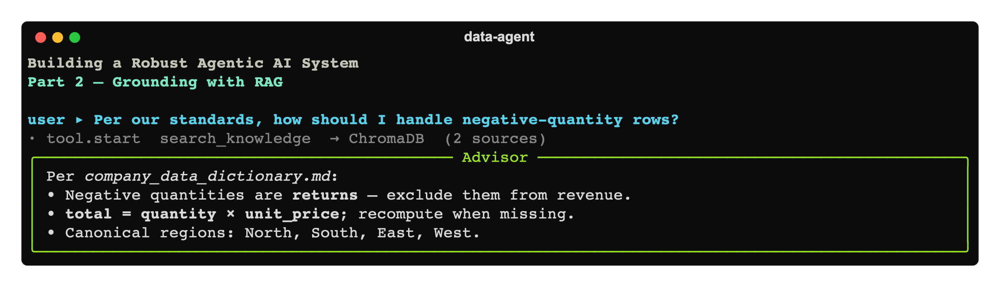

# Building a Robust Agentic AI System, Part 2: Grounding the Agents with RAG



*Part 2 of a hands-on series on building a real multi-agent data assistant with the OpenAI
Agents SDK. In [Part 1](../01-foundation/article.md) we built the foundation: a triage
router, a Data Engineer that writes and runs cleaning code, a Frontend Builder, an Advisor,
a safety guardrail, persistent memory, and tracing. Here we make the agents **knowledgeable
about your world** — and learn that telling a model to "look it up" isn't enough; you have
to make it.*

The code for this part is in [`code/`](./code), complete and runnable.

---

## 1. The problem: a smart agent that doesn't know *your* rules

Our Part 1 assistant is capable, but it answers from the model's **general** knowledge. Ask
it *"how should I handle negative-quantity rows?"* and it'll give a reasonable-sounding,
generic answer. But your organization has *specific* rules — maybe negative quantities are
returns that must be **excluded from revenue**, maybe `total` is **defined** as
`quantity × unit_price` and recomputed when it disagrees. The model can't know that. Worse,
a confident model will **invent** an answer — and even cite a source file that doesn't exist.

The fix is **Retrieval-Augmented Generation (RAG)**: keep your facts in documents, retrieve
the relevant passages at query time, and hand them to the model as context. Answers stay
grounded in *your* truth, and you update knowledge by editing files — no fine-tuning.

---

## 2. What RAG actually is

```
knowledge/*.md ─chunk─▶ text chunks ──┐
                                       ├─▶ vector store (embeds + indexes)
query ─────────────────────────────────┘            │
                                                      ▼
                          similarity search ──▶ top-k chunks ──▶ into the prompt
```

Two phases:

1. **Index (once, offline):** split your documents into chunks, convert each to an
   **embedding** (a vector capturing meaning), and store them in a vector database.
2. **Retrieve (per query):** embed the user's question, find the chunks whose vectors are
   most similar, and inject those passages into the model's context.

A crucial design choice: we expose retrieval as a **tool the agent calls on demand**
(`search_knowledge`) rather than stuffing all documents into every system prompt. The agent
pulls only what's relevant for the question at hand — cheaper, and it scales to far more
knowledge than fits in a prompt.

---

## 3. The knowledge base

We add a `knowledge/` folder with two markdown files the agents treat as ground truth:

- **`company_data_dictionary.md`** — the authoritative definition of the `sales` dataset:
  canonical region values (North/South/East/West), the rule that `total = quantity ×
  unit_price`, and the rule that **negative quantity = a return, excluded from revenue**.
- **`data_engineering_principles.md`** — the house style: idempotent pipelines, the
  medallion (bronze/silver/gold) pattern, and the data-quality checks to run after cleaning.

These are exactly the facts a new engineer would need — and exactly what a generic LLM can't
guess.

---

## 4. Why ChromaDB

You *could* store vectors in a JSON file and compute cosine similarity by hand (great for
seeing the mechanics). But a purpose-built **vector database** gives you, for free:
persistent on-disk storage, an approximate-nearest-neighbour (HNSW) index that scales past
brute-force search, embedding management, and metadata stored alongside each vector. We use
**ChromaDB** running embedded (in-process, on-disk) — perfect for this scale, and the same
code talks to a client/server deployment later by swapping one line.

The whole engine lives in [`code/src/data_agent/rag.py`](./code/src/data_agent/rag.py).

### Embedding is delegated to Chroma

Chroma can embed text for us via an attached **embedding function** — we give it OpenAI's:

```python
def _embedding_function():
    return embedding_functions.OpenAIEmbeddingFunction(
        api_key=os.environ.get("OPENAI_API_KEY"),
        model_name=config.EMBED_MODEL,        # text-embedding-3-small
    )
```

Now `collection.add(documents=[...])` embeds-and-stores in one call, and
`collection.query(query_texts=[...])` embeds-and-searches in one call.

### Building the index

`build_index()` (called by `python -m data_agent.ingest`) chunks each doc into overlapping
~900-character pieces, then adds them with a stable id and a `source` metadata field:

```python
collection.add(ids=ids, documents=documents, metadatas=[{"source": s} for s in sources])
```

Overlapping chunks keep ideas that straddle a boundary retrievable. Re-ingesting drops and
rebuilds the collection, so it's idempotent.

### Searching

```python
def search(query: str, k: int = 4) -> list[dict]:
    res = _get_collection().query(query_texts=[query], n_results=k)
    return [{"source": m.get("source"), "text": d, "score": 1.0 - float(dist)}
            for d, m, dist in zip(res["documents"][0], res["metadatas"][0], res["distances"][0])]
```

Chroma returns *distance*; we report `1 - distance` as a cosine-similarity score so callers
can reason about relevance.

> **A subtle bug worth the lesson.** Use a **single, cached** `PersistentClient` per process.
> Opening several clients on the same on-disk path causes SQLite contention and intermittent
> failures — which, if your "is it indexed?" check swallows exceptions, surface as a baffling
> "knowledge base not indexed" message *even though it is*. The fix in `rag.py` is a cached
> `_client()` reused by indexing, searching, and the existence check.

---

## 5. The retrieval tool

[`code/src/data_agent/tools/knowledge.py`](./code/src/data_agent/tools/knowledge.py) wraps
`search` in a `@function_tool`. The docstring matters — it's how the model knows *when* to
reach for it:

```python
@function_tool
def search_knowledge(query: str) -> str:
    """Search the company knowledge base (data dictionary + engineering principles) for
    grounded facts and rules. Use this before making assumptions about business rules,
    canonical values, or how a column should be cleaned — the answers here are authoritative.
    """
    if not rag.index_exists():
        return "Knowledge base is not indexed yet. Ask the user to run `python -m data_agent.ingest`."
    hits = rag.search(query, k=4)
    return "\n\n---\n\n".join(f"[source: {h['source']} · relevance {h['score']:.2f}]\n{h['text']}" for h in hits)
```

We give this tool to the **Data Engineer** (so it cleans to your rules) and the **Advisor**
(so it advises from your standards) — see
[`code/src/data_agent/team.py`](./code/src/data_agent/team.py). The Data Engineer's
instructions now begin with *"Ground yourself first: call search_knowledge for the
authoritative business rules before you assume anything."*

---

## 6. The reliability lesson: telling isn't enough — *force* the retrieval

Here's the part that surprised me, and it's the most important lesson in this article.

I gave the Advisor the `search_knowledge` tool and a firm instruction: *"you MUST call
search_knowledge first."* Then I asked it the negative-quantity question several times.
Sometimes it retrieved and answered perfectly. **Other times it skipped the tool entirely,
answered from memory, and cited `company_data_handling.md` — a file that does not exist** —
with advice that *contradicted* our actual rule.

A capable model often "believes" it already knows the answer. Prompt instructions help but
are **not reliable** on their own. The robust fix is structural — make grounding
unavoidable with `tool_choice="required"`:

```python
advisor = Agent(
    name="Advisor",
    tools=[search_knowledge],
    model_settings=ModelSettings(tool_choice="required"),
    instructions=...,
)
```

`tool_choice="required"` forces the model to call a tool on its first step (so it actually
retrieves). The SDK then auto-resets `tool_choice` to `"auto"` — because `reset_tool_choice`
defaults to `True` — so the *next* turn produces the final grounded answer without looping.
After this change, the Advisor retrieved and grounded correctly on every run.

> **The principle:** *don't trust the model to ground itself — make grounding structurally
> unavoidable.* This is a recurring theme in reliable agent design: where correctness
> matters, encode it in the harness, not just the prompt.

---

## 7. Run it

```bash
cd code
pip install -e .
cp .env.example .env                 # add OPENAI_API_KEY
python -m data_agent.ingest          # build the Chroma index (one time)
python -m data_agent.app
```

```
user ▸ Per our standards, how should I handle negative-quantity rows, and what defines total?
```

You'll see the Advisor call `search_knowledge`, then answer:

> *Per company_data_dictionary.md: negative quantities are returns and should be **excluded
> from revenue** (or tracked as a separate returns measure). `total` is defined as
> `quantity × unit_price`; recompute it when missing and prefer the formula when they
> disagree.*

Grounded, specific, and sourced — not a generic guess. The Data Engineer now uses the same
rules when it cleans, so the pipeline output matches your standards too.

**Cost note:** RAG is cheap. Indexing is a one-time embedding pass over a few thousand
tokens on `text-embedding-3-small` (fractions of a cent for this corpus); each query adds one
small embedding plus the retrieved passages' tokens — far fewer than stuffing every doc into
every prompt.

---

## 8. Scaling and what's next

This setup scales a long way. When you outgrow embedded Chroma, the *retrieval interface*
(`search(query) → top-k chunks`) stays identical while you swap the engine:

- Chroma in **client/server** mode (`HttpClient` instead of `PersistentClient`).
- **pgvector / Pinecone / Weaviate** for managed scale.
- OpenAI's **hosted vector stores + the SDK's built-in `FileSearchTool`** if you'd rather not
  run your own.
- Quality upgrades: a **re-ranking** step, **metadata filtering**, and a small **retrieval
  eval** so you can measure whether the right chunks come back (we'll add evals in Part 7).

Our agents are now grounded in your knowledge. But they can still only use the tools we
hand-wrote in Python. In **Part 3** we connect *external* tool servers over a standard
protocol — the **Model Context Protocol (MCP)** — and refactor the team into a factory so it
can manage those live connections.

**Next:** [Part 3 — Extending the Agents with MCP »](../03-mcp-extending-with-tools/article.md)
