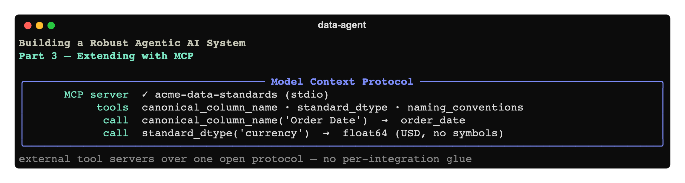

# Building a Robust Agentic AI System, Part 3: Extending the Agents with MCP



*Part 3 of a hands-on series. So far we have a multi-agent data assistant
([Part 1](../01-foundation/article.md)) grounded in a ChromaDB knowledge base
([Part 2](../02-rag-knowledge-base/article.md)). But the agents can still only use tools we
hand-wrote in Python. In this part we connect **external tool servers** over an open
standard — the **Model Context Protocol (MCP)** — and refactor the team into a factory so it
can manage those live connections.*

Code for this part: [`code/`](./code).

---

## 1. Why MCP?

Every integration you hard-code into an agent is bespoke glue: this API, that database, this
internal service. **MCP** is an open standard (introduced by Anthropic in late 2024, now
widely adopted) that lets an AI app talk to external tools and data over **one common
interface** — think "USB-C for tools." Write a capability once as an MCP **server**, and any
MCP-aware **client** — your app, Claude Desktop, an IDE — can use it. No per-integration glue.

The OpenAI Agents SDK is an MCP **client**. You point it at a server, and that server's tools
appear to the model right alongside its native `@function_tool`s. The model can't tell the
difference; you get to add capabilities without touching agent code.

To make this concrete (and offline-friendly), we **build our own** small MCP server and wire
it in — then show how to swap in third-party servers.

---

## 2. Authoring an MCP server

Our server provides *deterministic data-standards helpers* — distinct from RAG, which
returns prose. Here the model gets exact, machine-checked answers: a canonical snake_case
column name, the org's standard type for a column role, and the naming conventions. It lives
in [`code/mcp_servers/reference_server.py`](./code/mcp_servers/reference_server.py) and uses
`FastMCP`:

```python
from mcp.server.fastmcp import FastMCP

mcp = FastMCP("acme-data-standards")

@mcp.tool()
def canonical_column_name(name: str) -> str:
    """Convert a column name to the org's canonical snake_case form.
    Example: 'Order Date' -> 'order_date'."""
    ...

@mcp.tool()
def standard_dtype(column_role: str) -> str:
    """Return the org's standard data type for a column role (id, date, currency, ...)."""
    ...

if __name__ == "__main__":
    mcp.run()        # stdio transport by default
```

It speaks **stdio**: the client launches it as a subprocess and they talk over
stdin/stdout. You can smoke-test it standalone — `python mcp_servers/reference_server.py`
waits on stdio — but normally the app launches it for you.

> **RAG vs MCP — when to use which?** RAG retrieves *unstructured* knowledge (prose you
> reason over). MCP exposes *capabilities* (functions that compute or fetch exact values, or
> reach external systems). Our Data Engineer uses both: the knowledge base for the *rules*,
> the MCP server for precise *naming and typing*.

---

## 3. Connecting it: lifecycle is the catch

An MCP server is a **live connection** (here, a subprocess) that must be opened before a run
and closed cleanly after. That has one important consequence: we can no longer build our
agents at import time, because the servers don't exist yet. So `team.py` becomes a
**factory** — [`build_team(mcp_servers=None, with_knowledge=True)`](./code/src/data_agent/team.py):

```python
def build_team(mcp_servers=None, with_knowledge=True) -> Agent:
    mcp_servers = list(mcp_servers or [])
    kb = [search_knowledge] if with_knowledge else []
    data_engineer = Agent(..., tools=[..., *kb], mcp_servers=mcp_servers)
    advisor = Agent(..., tools=[*kb], mcp_servers=mcp_servers,
                    model_settings=ModelSettings(tool_choice="required") if kb else ModelSettings())
    ...
    return triage_agent
```

This refactor is a feature, not a chore: it makes RAG and MCP **toggleable** (handy for
tests — `build_team(with_knowledge=False)` gives a bare team in one line) and keeps the live
connections out of module import.

The app opens the server and passes it in, using an `AsyncExitStack` to guarantee cleanup —
see [`code/src/data_agent/app.py`](./code/src/data_agent/app.py):

```python
async with AsyncExitStack() as stack:
    server = MCPServerStdio(
        params={"command": sys.executable, "args": [str(config.REFERENCE_MCP_SERVER)]},
        name="acme-data-standards", cache_tools_list=True, client_session_timeout_seconds=30,
    )
    await stack.enter_async_context(server)        # connect now; clean up on exit
    triage = build_team(mcp_servers=[server], with_knowledge=True)
    ...                                            # run the REPL inside this scope
```

`cache_tools_list=True` avoids re-listing the server's tools on every turn; the generous
timeout gives the subprocess room to start.

We give the MCP server to the **Data Engineer** and **Advisor** (both benefit from
naming/typing helpers); the Frontend Builder doesn't need it — **least privilege** again.

---

## 4. Run it

```bash
cd code
pip install -e .
cp .env.example .env                 # add OPENAI_API_KEY
python -m data_agent.ingest          # build the knowledge base
python -m data_agent.app             # the MCP server launches automatically
```

```
user ▸ Per our standards, what's the canonical snake_case name for 'Order Date', and how should I handle returns?
```

In the trace you'll see the Advisor call `canonical_column_name` (MCP) **and**
`search_knowledge` (RAG) in the same turn, then answer: `order_date`, and returns are
excluded from revenue. Two capability sources, one coherent answer.

---

## 5. The real payoff: third-party servers

The point of a standard is that you don't have to write the servers. Point `MCPServerStdio`
(or `MCPServerStreamableHttp` for remote ones) at any published server and its tools become
available to your agents with **zero code changes**:

```python
fs = MCPServerStdio(params={"command": "npx",
    "args": ["-y", "@modelcontextprotocol/server-filesystem", "/path/to/dir"]})
# then: build_team(mcp_servers=[server, fs], ...)
```

There's a growing ecosystem — filesystem, fetch, GitHub, Slack, Postgres, and many more.

### A word on MCP security

The moment you connect *remote* or third-party servers, MCP becomes a security surface, and
current guidance is clear: **treat every MCP server as a trust boundary.** In practice:

- **Allowlist** the servers you connect; don't auto-discover arbitrary ones.
- **Least-privilege scopes** and a dedicated credential per agent/server — never reuse a
  broad-permission account.
- **Authenticate** between host, client, and server before exchanging sensitive commands.
- **Log tool I/O** end-to-end (prompt → tool selection → inputs → outputs) so you can
  investigate chained actions. We add structured logging for exactly this in Part 6.

Our local stdio server sidesteps most of this (no network, no auth, runs as you), but the
habits matter the moment you go beyond your own machine.

---

## 6. Where we are, and what's next

The agents are now **grounded** (RAG) *and* **extensible** (MCP), and the team is built by a
clean factory that manages live connections. But the way you *interact* with all this is
still a bare `input()` loop with a couple of slash commands, and there's no way to tune the
model, cap cost, or see token usage.

**Part 4 — CLI & Developer Experience** fixes that: `argparse` subcommands (`chat`, `ingest`,
`info`) with `-h` help everywhere, a `rich` REPL that renders markdown and reports per-turn
token usage, and flags for model choice, fresh sessions, and a `max_turns` cost guard.

**Next:** [Part 4 — CLI & Developer Experience »](../04-cli-and-developer-experience/article.md)
