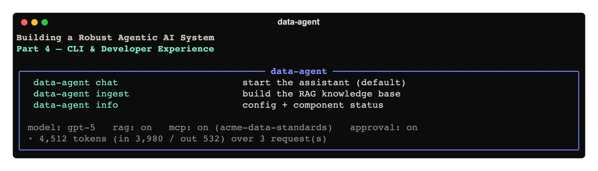

# Building a Robust Agentic AI System, Part 4: CLI & Developer Experience



*Part 4 of a hands-on series. Our assistant is now capable ([Part 1](../01-foundation/article.md)),
grounded in a knowledge base ([Part 2](../02-rag-knowledge-base/article.md)), and extensible
via MCP ([Part 3](../03-mcp-extending-with-tools/article.md)). But you interact with it
through a bare `input()` loop. This part turns that into a real command-line tool — with
subcommands, `-h` help, rich output, token-usage visibility, and cost controls — because
**developer experience is what makes a system usable day to day.***

Code: [`code/`](./code).

---

## 1. Why bother with the CLI?

It's tempting to treat the interface as an afterthought. Don't. The CLI is where you'll spend
hundreds of hours building, debugging, and demoing. Three concrete wins from this article:

- **Discoverability** — `-h` on every command means you (and your readers) never guess.
- **Operability** — an `info` command shows config and component status at a glance; flags
  let you switch models, reset memory, or disable a subsystem to isolate a problem.
- **Cost awareness** — per-turn token usage printed inline, plus a `--max-turns` guard so a
  misbehaving loop can't run away.

All of this lives in [`code/src/data_agent/app.py`](./code/src/data_agent/app.py).

---

## 2. Subcommands with `argparse`

We expose three subcommands — `chat` (default), `ingest`, `info`:

```bash
data-agent -h                 # top-level help
data-agent chat -h            # all chat flags
data-agent ingest             # build/refresh the RAG index (was `python -m data_agent.ingest`)
data-agent info               # config + component status
data-agent                    # chat is the default
```

`argparse` gives you `-h` for free at every level — define good `help=` strings and
descriptions and the documentation writes itself. The one bit of polish is making `chat` the
**default** so bare `data-agent` just works, while still allowing top-level flags:

```python
def run():
    argv = sys.argv[1:]
    help_flags = {"-h", "--help", "--version"}
    if not argv:
        argv = ["chat"]
    elif argv[0] not in _COMMANDS and argv[0] not in help_flags:
        argv = ["chat"] + argv          # `data-agent --model x` -> `data-agent chat --model x`
    args = _build_parser().parse_args(argv)
    ...
```

The `ingest` we wrote as a standalone module in Part 2 now folds in as `data-agent ingest`,
and a new `info` command prints a `rich` table of models, RAG index status, and MCP status —
the first thing to run when something looks off.

---

## 3. A `rich` REPL

[`rich`](https://github.com/Textualize/rich) upgrades the loop from `print()` to something
pleasant: assistant replies render as **markdown**, a **spinner** shows while the agent
thinks, and each turn ends with a dim **token-usage** line.

```python
with console.status("[dim]thinking…[/]", spinner="dots"):
    result = await Runner.run(triage, user, context=context,
                              session=session, max_turns=max_turns)

console.print(Panel(Markdown(str(result.final_output)),
                    title=f"[green]{result.last_agent.name}[/]", border_style="green"))
_print_usage(result)        # "· 4,512 tokens (in 3,980 / out 532) over 3 request(s)"
```

Two small touches with outsized value:

- **`result.last_agent.name`** in the panel title tells you *which specialist* produced the
  answer — instant insight into routing without opening the trace.
- **Token usage** from `result.context_wrapper.usage` makes cost tangible turn by turn. (See
  the cost discussion in Part 1; now you can watch it live.)

---

## 4. Flags that matter

```bash
data-agent chat --model gpt-4.1     # override the reasoning model for this run
data-agent chat --reset             # start a fresh conversation (clears session memory)
data-agent chat --max-turns 12      # cap agent-loop steps (cost / runaway guard)
data-agent chat --no-mcp            # disable MCP servers (isolate a problem)
data-agent chat --no-rag            # disable the knowledge tool
data-agent chat --no-trace          # turn off tracing for this run
```

A neat detail: `--model` mutates `config.MODEL` *before* `build_team()` runs. Because the
factory reads `config.MODEL` at call time (Part 3's refactor paying off), every agent picks
up the override with no extra plumbing:

```python
if args.model:
    config.MODEL = args.model          # build_team() reads this when it constructs agents
```

`--no-mcp` / `--no-rag` are more than convenience — being able to **toggle a subsystem off**
is how you bisect a misbehaving run: does the problem persist without MCP? Without RAG? That's
debugging methodology baked into the CLI.

---

## 5. Run it

```bash
cd code
pip install -e .
cp .env.example .env
data-agent ingest
data-agent info          # confirm RAG built ✓, MCP ✓
data-agent               # chat with the rich REPL
```

```
user ▸ Profile and clean data/raw/sales_2024.csv, then load it as a table called sales.
```

You'll get a spinner while it works, a green panel showing the **Data Engineer**'s summary,
and a token-usage line underneath. Then build the dashboard and launch it with
`streamlit run workspace/dashboard.py`.

---

## 6. Where we are, and what's next

The system is now genuinely pleasant to use: discoverable commands, readable output, visible
cost, and switches to isolate behavior. That's the inflection point where a project stops
being a demo and starts being a tool you reach for.

From here, the remaining parts are about **trust**. We have exactly one guardrail (an input
relevance check) and a code-execution tool that runs whatever the model writes, with no
human in the loop. **Part 5 — Guardrails & Safety** addresses that head-on: an **output
guardrail** (catch secrets/PII before they reach the user), **tool guardrails** (validate at
the tool boundary), and **human-in-the-loop approval** before the agent executes code or
writes files.

**Next:** [Part 5 — Guardrails & Safety »](../05-guardrails-and-safety/article.md)
