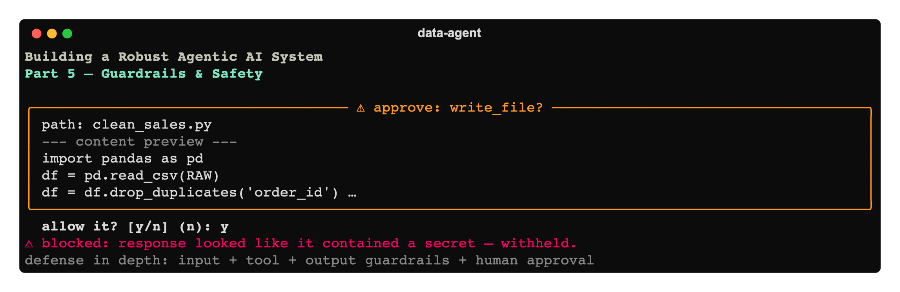

# Building a Robust Agentic AI System, Part 5: Guardrails & Safety



*Part 5 of a hands-on series. Our assistant can profile, clean, and pipeline data
([Part 1](../01-foundation/article.md)), ground itself in a knowledge base
([Part 2](../02-rag-knowledge-base/article.md)), reach external tools via MCP
([Part 3](../03-mcp-extending-with-tools/article.md)), and runs behind a real CLI
([Part 4](../04-cli-and-developer-experience/article.md)). It is also, right now, a thing
that **writes and executes arbitrary code on your machine** with a single input guardrail
standing between a user and that power. This part is about earning trust.*

Code: [`code/`](./code).

---

## 1. Defense in depth, not a single wall

There's no one check that makes an agent safe. The reliable pattern is **layered, cheap
checks at every boundary**, so a miss at one layer is caught at the next. Our system now has
four:

```
user input ─▶ [1 input guardrail] ─▶ agent loop ─▶ tool call ─▶ [2 tool-input guardrail]
                                                          │              │
                                                   [3 human approval]    ▼
                                                          ▼          tool runs
                                              final answer ─▶ [4 output guardrail] ─▶ user
```

1. **Input guardrail** (from Part 1) — is the request even in scope? Runs first, cheaply.
2. **Tool-input guardrail** (new) — are the *arguments* to a dangerous tool safe?
3. **Human-in-the-loop approval** (new) — a person confirms code execution / file writes.
4. **Output guardrail** (new) — did the final answer leak a secret?

All of the new checks are **deterministic regex/logic, no LLM** — so they're fast and add
negligible latency. They live in [`code/src/data_agent/safety.py`](./code/src/data_agent/safety.py).

---

## 2. Output guardrail: catch leaked secrets

An `@output_guardrail` runs on the agent's final answer and can trip a wire that stops the
response from reaching the user. Ours scans for key/token/private-key patterns:

```python
@output_guardrail
async def secret_leakage_guardrail(ctx, agent, output) -> GuardrailFunctionOutput:
    text = output if isinstance(output, str) else str(output)
    hits = [label for pattern, label in _SECRET_PATTERNS if re.search(pattern, text)]
    return GuardrailFunctionOutput(output_info={"matched": hits}, tripwire_triggered=bool(hits))
```

We attach it to **every** agent in `build_team(...)` (whichever one produces the final
output gets checked). If it trips, the SDK raises `OutputGuardrailTripwireTriggered`, which
the CLI catches and replaces with a safe "I withheld that" message. Cheap insurance against
a model echoing a credential it saw in a file or error message.

---

## 3. Tool-input guardrail: refuse dangerous generated code

`safe_resolve` (Part 1) constrains *where* files go. A tool-input guardrail constrains *what*
the generated code may do. It runs at the tool boundary, reads the arguments, and can refuse:

```python
@tool_input_guardrail
def dangerous_code_guardrail(data) -> ToolGuardrailFunctionOutput:
    args = json.loads(data.context.tool_arguments or "{}")
    content = args.get("content", "") or ""
    for pattern, label in _DANGEROUS_CODE:
        if re.search(pattern, content):
            return ToolGuardrailFunctionOutput.reject_content(
                message=f"Refused: the file contains a disallowed operation ({label}). Rewrite without …")
    return ToolGuardrailFunctionOutput.allow()
```

We attach it to `write_file` (`tool_input_guardrails=[dangerous_code_guardrail]`). It blocks
shell calls, network access, recursive deletes, `eval`/`exec`, and writes outside the
sandbox. Crucially it **rejects the content** (returns a message) rather than crashing — so
the model sees *why* and can rewrite a safe version. (Tune the patterns to your risk
tolerance; too aggressive and you'll reject legitimate scripts.)

---

## 4. Human-in-the-loop: a person approves code execution

The highest-risk thing this agent does is run code it wrote. For anything that can affect
the world, current practice is a **human checkpoint**. We gate both `write_file` and
`run_python_file`: by default the CLI prints the proposed action and asks you to confirm.

### Two ways to do this — and why we chose the simple one

The Agents SDK ships a **native** mechanism: mark a tool `needs_approval=True` and the run
*pauses*, returning `result.interruptions`; you approve/reject on a `RunState` and resume the
run. That's the right tool when approval happens **out-of-process** — a web UI, a Slack
button, an approval queue — because the run can be serialized, parked, and resumed later by
someone else.

For a **synchronous local CLI**, we use a simpler approach: the tool asks the run context
for an OK, inline, right when it's about to act. The run context (Part 1) carries an
`approver` callback and an `auto_approve` flag:

```python
# context.py
def approve(self, action: str, detail: str) -> bool:
    if self.auto_approve or self.approver is None:
        return True
    return self.approver(action, detail)
```

```python
# tools/filesystem.py — inside write_file, before writing
detail = f"path: {path}\n--- content preview ---\n{content[:800]}"
if not ctx.context.approve("write_file", detail):
    return "DECLINED by user: file not written. Adjust the plan or ask the user."
```

The CLI supplies the approver (a `rich` yes/no prompt) and sets `auto_approve` from the
`--auto-approve` flag. When the model declines, the tool returns a *message* the agent can
react to — it doesn't crash. This is deterministic, trivial to unit-test (pass a lambda
approver), and keeps the prompt next to the action.

> **Trade-off we made on purpose:** the prompt appears mid-run, so we dropped the animated
> "thinking…" spinner during a turn (a live spinner and an input prompt fight over the
> terminal). A small UX cost for a clean, reliable approval flow. *Rule of thumb: in-process
> CLI → in-tool approval; out-of-process / async UI → the SDK's `needs_approval` +
> interruptions.*

### Should you confirm BOTH tools, just one, or neither?

This is a real design decision, so here's the trade-off explicitly. Our default is **confirm
both**, but pick what fits your environment:

| Policy | Pros | Cons | Good for |
|---|---|---|---|
| **Confirm both** (`write_file` + `run_python_file`) — our default | Maximum oversight: you see every script *before it's written* and again *before it runs*; catches a bad write even if the code guardrail misses it | Most interruptions; the smooth "clean + load" flow becomes several y/n prompts | Teaching, untrusted input, anything touching shared/real data |
| **Confirm only `run_python_file`** | Far fewer prompts; writing to the sandbox is already constrained by `safe_resolve` *and* the dangerous-code guardrail, so a write alone can't do harm — **execution** is where effects happen | A malicious/buggy script can land on disk unreviewed (only caught at run time); if you later add a tool that *reads* those files, the gap widens | Day-to-day local dev where you trust the workspace but want a gate on side effects |
| **Confirm neither** (`--auto-approve`) | Zero friction; scriptable; needed for automated/CI runs | No human gate at all — you're trusting the model + the static guardrails entirely | Demos, CI, fully-sandboxed throwaway environments |

The reasoning behind the spectrum: a **write** is reversible and contained (it just puts text
in a sandboxed file that two other layers already vet); an **execution** is where code
actually *does* things. So "confirm only run" is a defensible middle ground. We confirm both
by default because this is a teaching system and the cost of an extra prompt is low — but in
a real product you'd likely confirm execution always and make writes configurable. Whatever
you choose, make it **explicit and visible** (the banner shows the current approval mode),
never a silent default.

---

## 5. Run it

```bash
cd code
pip install -e .
cp .env.example .env
data-agent ingest
data-agent                              # approval ON — you'll confirm writes + runs
```

Ask it to *"clean data/raw/sales_2024.csv and load it as table sales."* You'll see, inline:

```
⚠ approve: write_file?     path: clean_sales.py  --- content preview --- import pandas …
  allow it? [y/n] (n): y
⚠ approve: run_python_file?   execute workspace/clean_sales.py
  allow it? [y/n] (n): y
```

Answer `n` and the agent is told the action was declined and adapts. For an uninterrupted
demo or automation, run `data-agent chat --auto-approve` (the banner will show
`approval: auto`).

---

## 6. Where we are, and what's next

The agent is now defended at four boundaries and won't execute code or surface secrets
without a check. It's *safe enough to hand to someone else*.

What it still lacks is **operational** robustness: when the OpenAI API hiccups, a tool throws,
or a run misbehaves, we want retries, real logging, and the ability to see what happened
after the fact — not just `print()`. **Part 6 — Resilience & Observability** adds retry/backoff,
structured logging that correlates each step, and exporting traces to your own stack.

**Next:** [Part 6 — Resilience & Observability »](../06-resilience-and-observability/article.md)
