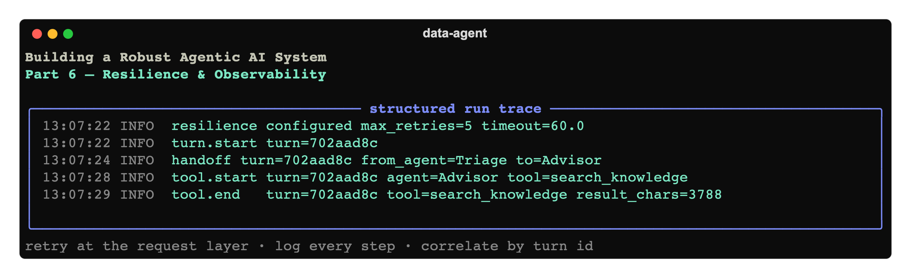

# Building a Robust Agentic AI System, Part 6: Resilience & Observability



*Part 6 of a hands-on series. Our assistant is capable, grounded
([Part 2](../02-rag-knowledge-base/article.md)), extensible
([Part 3](../03-mcp-extending-with-tools/article.md)), usable
([Part 4](../04-cli-and-developer-experience/article.md)), and safe
([Part 5](../05-guardrails-and-safety/article.md)). This part makes it **operable**: it
survives a flaky API, and it tells you what it did. Two unglamorous capabilities that decide
whether a system is trustworthy in production.*

Code: [`code/`](./code).

---

## 1. Resilience: retry at the right layer

The model API will occasionally rate-limit you (429), time out, or return a 5xx. A robust
system rides those out. The tempting fix is to wrap the whole turn in a retry loop:

```python
for attempt in range(3):           # ❌ DON'T do this
    try:
        return await Runner.run(triage, user, ...)
    except APIError:
        ...
```

**This is a trap.** An agent run has *side effects* — it writes files, executes code, loads
database tables. Re-running it after a partial failure can duplicate a load, re-run a
destructive script, or corrupt state. Retrying a non-idempotent operation is how "resilience"
becomes data corruption.

The correct layer is the **individual HTTP request** to the model. A transient failure there
should retry that one request with exponential backoff — *without* re-running the agent loop
or its tools. The OpenAI client already implements this; we just configure it and register it
as the SDK's default (see [`code/src/data_agent/resilience.py`](./code/src/data_agent/resilience.py)):

```python
def configure_resilience() -> None:
    client = AsyncOpenAI(
        max_retries=int(os.getenv("OPENAI_MAX_RETRIES", "5")),  # 408/409/429/5xx + conn errors
        timeout=float(os.getenv("OPENAI_TIMEOUT", "60")),       # bound a single request
    )
    set_default_openai_client(client)
```

`max_retries` retries the failing request with backoff, transparently — the agent loop never
sees the blip, and no tool runs twice. `timeout` stops a hung request from stalling a turn
forever. One call, registered once at startup.

> **The principle:** retry *idempotent* units (a single API request), never *effectful* ones
> (a whole agent run). If you ever do need run-level retries, make the tools idempotent first
> (e.g. SQLite loads use `if_exists="replace"`, keyed on a natural id) so a re-run is safe.

---

## 2. Observability: know what the agent did

When an agentic system surprises you — wrong route, skipped tool, weird answer — you need to
see the *sequence of decisions*, not just the final text. We add three things.

### 2.1 Structured logging

One logger (`data_agent`), quiet on the console by default, with an optional file sink. We
log **logfmt** `key=value` pairs — readable by humans, greppable by machines (see
[`code/src/data_agent/observability.py`](./code/src/data_agent/observability.py)):

```python
def configure_logging(verbose=False, log_file=None):
    console = logging.StreamHandler()
    console.setLevel(logging.INFO if verbose else logging.WARNING)   # quiet unless asked
    ...
    if log_file:
        logger.addHandler(logging.FileHandler(log_file))             # full INFO trace to disk
```

### 2.2 Lifecycle hooks — a step-by-step trace

The SDK exposes **`RunHooks`**: callbacks it invokes as a run progresses — agent start/end,
every tool start/end, every handoff. Implementing them gives you a structured record of *what
the agent actually did*, correlated by a per-turn id:

```python
class AgentLogHooks(RunHooks):
    def __init__(self, turn_id): self.turn = turn_id
    async def on_handoff(self, context, from_agent, to_agent):
        logger.info("handoff " + kv(turn=self.turn, from_agent=from_agent.name, to=to_agent.name))
    async def on_tool_start(self, context, agent, tool):
        logger.info("tool.start " + kv(turn=self.turn, agent=agent.name, tool=tool.name))
    async def on_tool_end(self, context, agent, tool, result):
        logger.info("tool.end " + kv(turn=self.turn, tool=tool.name, result_chars=len(str(result))))
```

You pass an instance per turn: `Runner.run(triage, user, ..., hooks=AgentLogHooks(turn_id))`.
Run with `--verbose` and a real turn looks like this:

```
13:07:22 INFO  resilience configured max_retries=5 timeout=60.0
13:07:22 INFO  turn.start turn=702aad8c
13:07:22 INFO  agent.start turn=702aad8c agent=Triage
13:07:24 INFO  handoff turn=702aad8c from_agent=Triage to=Advisor
13:07:27 INFO  agent.start turn=702aad8c agent=Advisor
13:07:28 INFO  tool.start turn=702aad8c agent=Advisor tool=search_knowledge
13:07:29 INFO  tool.end   turn=702aad8c tool=search_knowledge result_chars=3788
```

You can read the agent's reasoning path at a glance: triage routed to the Advisor, which
retrieved from the knowledge base. That's the single most useful artifact for debugging
agentic behavior after the fact — and with `--log-file` it's captured for every run.

### 2.3 No more silent failures

Observability also means *not hiding* errors. We swept the codebase for `except: pass` — the
classic "it works on my machine, mysteriously breaks on yours" bug — and made them log. For
example, `rag.index_exists()` must not crash callers like `info`, but it now records *why* it
failed at debug level instead of swallowing it:

```python
except Exception:
    logger.debug("index_exists check failed", exc_info=True)
    return False
```

And the REPL logs full tracebacks (`logger.exception(...)`) for unexpected errors while still
showing the user a one-line summary tagged with the turn id — so a bug report comes with a
trace.

---

## 3. Beyond logs: the trace dashboard and exporting elsewhere

The SDK also emits **spans** to the OpenAI **Traces dashboard** by default (disable with
`--no-trace`): a visual tree of agents, tools, handoffs, and token usage per run. For
production you'll usually forward traces to your own stack. The SDK supports custom
processors:

```python
from agents import add_trace_processor
add_trace_processor(MyOTelProcessor())   # OpenTelemetry, Langfuse, MLflow, ...
```

Hooks + structured logs cover day-to-day debugging locally; a trace processor wires the same
events into your observability platform when you deploy. The events are the same; only the
sink changes.

---

## 4. Run it

```bash
cd code
pip install -e .
cp .env.example .env
data-agent ingest

data-agent chat --verbose                    # stream the step-by-step trace to the console
data-agent chat --log-file workspace/agent.log   # capture it to a file instead
```

Tune resilience via `OPENAI_MAX_RETRIES` and `OPENAI_TIMEOUT` in `.env`.

---

## 5. Where we are, and what's next

The assistant now degrades gracefully under API turbulence and leaves a legible trail of
every decision. Combined with Part 5's safety layers, it's genuinely operable.

One thing still separates this from something you'd ship: **proof that it works, and a way to
keep it working.** Agentic behavior is sensitive to prompt and model changes, and there's no
test suite catching regressions. **Part 7 — Evals, Tests & CI** closes the loop: unit tests
for the deterministic pieces, an *evaluation* suite that asserts on routing, tool use, and
grounding, and a CI workflow that runs them — turning "it worked when I tried it" into "it's
verified on every change."

**Next:** [Part 7 — Evals, Tests & CI »](../07-evals-tests-and-ci/article.md)
