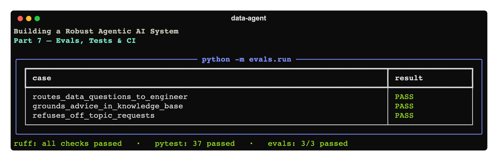

# Building a Robust Agentic AI System, Part 7: Evals, Tests & CI



*The finale of a hands-on series. Over six parts we built a multi-agent data assistant
([1](../01-foundation/article.md)), grounded it in a knowledge base
([2](../02-rag-knowledge-base/article.md)), extended it via MCP
([3](../03-mcp-extending-with-tools/article.md)), gave it a real CLI
([4](../04-cli-and-developer-experience/article.md)), made it safe
([5](../05-guardrails-and-safety/article.md)), and made it operable
([6](../06-resilience-and-observability/article.md)). One thing still separates it from
something you'd ship with confidence: **proof that it works, and a way to keep it working.**
This part closes the loop with tests, evals, and CI.*

Code: [`code/`](./code).

---

## 1. Two kinds of checks, because agents have two kinds of behavior

Agentic systems mix **deterministic** code (path safety, chunking, regex guardrails) with
**probabilistic** behavior (which agent the model routes to, whether it retrieves before
answering). You need a different check for each:

| | Unit tests | Evals |
|---|---|---|
| Targets | deterministic code | model behavior |
| Calls the model? | No | Yes |
| Speed / cost | instant / free | slow / costs tokens |
| Determinism | exact assertions | tolerant assertions |
| Runs in CI | every push | gated (secret, on `main`) |

Skip either and you have a blind spot: unit tests alone won't catch a prompt change that
breaks routing; evals alone are too slow and flaky to gate every commit. We build both.

---

## 2. Unit tests: pin down the deterministic seams

The most valuable thing about the "decisions to the model, correctness to code" philosophy
is that the *correctness* half is **ordinary code you can unit-test**. We test the load-bearing
deterministic pieces in [`code/tests/`](./code/tests) — no API key, instant:

- **The sandbox** (`test_paths.py`) — the security-critical one. Traversal and absolute
  paths must be rejected:

  ```python
  def test_rejects_parent_traversal(tmp_path):
      with pytest.raises(PathNotAllowed):
          safe_resolve("../escape.txt", tmp_path)
  ```

- **The RAG chunker** — splits and packs paragraphs within the size budget.
- **The safety regexes** — secrets are flagged; normal cleaning code is *not* (a false
  positive here would loop the agent, as we learned in Part 5).
- **The approval logic** — `auto_approve` skips, an approver's decision is honored, the
  no-approver default allows.
- **The MCP tools** — `canonical_column_name("Order Date") == "order_date"`.

These are the seams where a refactor silently breaks something. `pytest` runs them in well
under a second.

---

## 3. Evals: assert on what the agent *does*

A unit test can't tell you whether triage still routes a data question to the Data Engineer,
or whether the Advisor still retrieves before answering — that's model behavior. **Evals**
run the real agent against representative prompts and make *tolerant* assertions about the
outcome. Each case is declarative (see [`code/evals/evalset.py`](./code/evals/evalset.py)):

```python
CASES = [
    EvalCase("routes_data_questions_to_engineer",
             prompt="What data do I have to work with?",
             expect_agent="Data Engineer", expect_tools=["list_datasets"]),
    EvalCase("grounds_advice_in_knowledge_base",
             prompt="Per our standards, how should I handle negative-quantity rows?",
             expect_agent="Advisor", expect_tools=["search_knowledge"],
             expect_substrings=["return"]),
    EvalCase("refuses_off_topic_requests",
             prompt="Write me a long poem about the ocean.",
             expect_guardrail=True),
]
```

The harness runs each turn, then inspects the result for the agent that answered, the tools
that were called (`result.new_items`), the output text, and whether the input guardrail
tripped. `python -m evals.run` prints a verdict table and exits non-zero on failure:

```
┃ case                             ┃ result ┃ detail
┡━━━━━━━━━━━━━━━━━━━━━━━━━━━━━━━━━━━╇━━━━━━━━╇━━━━━━━━━━━━━━━━━━━━━━━━━━━━━━━━━
│ routes_data_questions_to_engineer│ PASS   │ ok (agent=Data Engineer, tools=['list_datasets'])
│ grounds_advice_in_knowledge_base │ PASS   │ ok (agent=Advisor, tools=['search_knowledge'])
│ refuses_off_topic_requests       │ PASS   │ guardrail tripped
```

Two design notes:

- **Assert on behavior, not wording.** We check *that* `search_knowledge` was called and the
  answer mentions "return" — not the exact prose. Asserting on exact text makes evals brittle
  against harmless phrasing changes.
- **This is the heart of the Agent Development Lifecycle.** When observability (Part 6)
  surfaces a failure in the wild, you turn it into a new `EvalCase`. The eval suite becomes a
  growing regression net that encodes every behavior you care about — so a prompt or model
  change can't quietly undo it.

---

## 4. CI: make the checks automatic

Tests you have to remember to run don't get run. [`code/.github/workflows/ci.yml`](./code/.github/workflows/ci.yml)
splits the work by cost:

```yaml
jobs:
  test:                      # every push / PR — free, fast, deterministic
    steps:
      - run: pip install -e ".[dev]"
      - run: ruff check .
      - run: pytest
  evals:                     # only on main, only if a key secret exists
    needs: test
    if: github.ref == 'refs/heads/main'
    env:
      OPENAI_API_KEY: ${{ secrets.OPENAI_API_KEY }}
      OPENAI_MODEL: gpt-4.1  # cheaper/faster for CI
    steps:
      - run: python -m evals.run
```

The reasoning: **lint + unit tests gate every change** (they're free and deterministic),
while **evals run only where it makes sense** — on `main`, with a real key from secrets, on a
cheaper model. This keeps PRs fast and free while still catching behavioral regressions before
they reach users. (Fork PRs don't have the secret, so the eval job no-ops rather than failing.)

Dev tooling lives in `pyproject.toml`: `pip install -e ".[dev]"` brings in `pytest` and
`ruff`, with ruff configured for a sane lint set (pyflakes, isort, pyupgrade, bugbear).

---

## 5. Run it

```bash
cd code
pip install -e ".[dev]"
ruff check .          # lint
pytest                # deterministic unit tests — no key needed
python -m evals.run   # behavioral evals — needs OPENAI_API_KEY (try OPENAI_MODEL=gpt-4.1)
```

---

## 6. The whole arc

Seven parts, one consistent idea: **give the model the decisions and keep correctness in
code you control.** Concretely, we built:

1. **Foundation** — agents, tools, handoffs, a triage router, an input guardrail, sessions,
   structured outputs, tracing.
2. **RAG** — a ChromaDB knowledge base and a retrieval tool, plus the lesson that you must
   *force* grounding (`tool_choice="required"`), not just ask for it.
3. **MCP** — external tool servers over an open protocol, and a team factory to manage them.
4. **CLI & DX** — subcommands, `-h`, a `rich` REPL, token-usage visibility, cost controls.
5. **Guardrails & Safety** — output + tool guardrails and human-in-the-loop approval for
   code execution.
6. **Resilience & Observability** — request-layer retries, structured logging, lifecycle
   hooks, trace export.
7. **Evals, Tests & CI** — deterministic unit tests, behavioral evals, and a CI workflow that
   runs them.

None of these steps is exotic. Together they're the difference between a demo that impresses
once and a system you can hand to someone, operate, change, and trust. That's what "robust"
means.

The complete, runnable code for every stage lives alongside its article — start at the
[series index](../../00-index.md), clone any `code/` folder, and build on it.

*Thanks for reading. Now go change a prompt and watch an eval catch it.*
